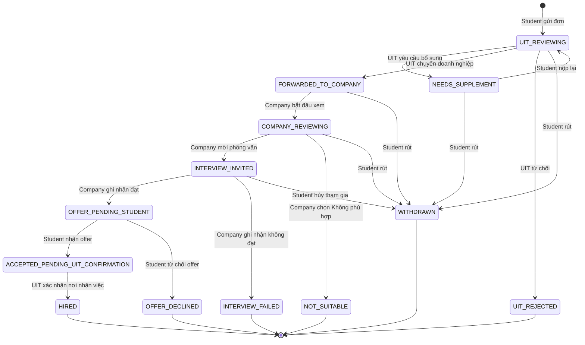

# Application state machine

## Sơ đồ

## Trạng thái và người xử lý tiếp

| Trạng thái kỹ thuật | Nhãn sinh viên | Người xử lý tiếp |
|---|---|---|
| `UIT_REVIEWING` | UIT đang kiểm tra hồ sơ | UIT_ADMIN |
| `NEEDS_SUPPLEMENT` | Cần bổ sung hồ sơ | STUDENT |
| `FORWARDED_TO_COMPANY` | Đã chuyển đến doanh nghiệp | COMPANY |
| `COMPANY_REVIEWING` | Doanh nghiệp đang xem hồ sơ | COMPANY |
| `INTERVIEW_INVITED` | Có lịch phỏng vấn mới | STUDENT/COMPANY |
| `NOT_SUITABLE` | Chưa phù hợp ở vòng sàng lọc | Kết thúc |
| `INTERVIEW_FAILED` | Chưa đạt sau phỏng vấn | Kết thúc |
| `OFFER_PENDING_STUDENT` | Bạn đã đạt; vui lòng phản hồi offer | STUDENT |
| `ACCEPTED_PENDING_UIT_CONFIRMATION` | Chờ UIT xác nhận nơi thực tập | UIT_ADMIN |
| `HIRED` | Đã xác nhận nhận việc | UIT theo dõi |
| `OFFER_DECLINED` | Bạn đã từ chối cơ hội | Kết thúc |
| `UIT_REJECTED` | Hồ sơ chưa đủ điều kiện | Kết thúc |
| `WITHDRAWN` | Bạn đã rút đơn | Kết thúc |

Trạng thái `ACCEPTED_PENDING_UIT_CONFIRMATION` hiện thực đúng hai xác nhận trong tài liệu: sinh viên đồng ý offer trước, UIT xác nhận nơi thực tập/nhận việc sau.

## Quy tắc rút đơn và từ chối

- Generic withdraw chỉ hợp lệ ở `UIT_REVIEWING`, `NEEDS_SUPPLEMENT`, `FORWARDED_TO_COMPANY`, `COMPANY_REVIEWING`.
- Tại `INTERVIEW_INVITED`, sinh viên dùng hành động hủy tham gia/rút khỏi quy trình; lý do bắt buộc và kết quả là `WITHDRAWN`.
- Tại `OFFER_PENDING_STUDENT`, không có generic withdraw; sinh viên dùng accept hoặc decline offer.
- `NOT_SUITABLE` là hành động riêng của doanh nghiệp trước/sàng lọc; `INTERVIEW_FAILED` dùng sau phỏng vấn.
- Yêu cầu bổ sung, UIT từ chối, Không phù hợp, không đạt, rút đơn, hủy tham gia và từ chối offer luôn ghi reason/note và history.

## Nhiều đơn và xác nhận nơi nhận việc

1. Doanh nghiệp đánh dấu đạt chỉ chuyển một đơn sang `OFFER_PENDING_STUDENT`; các đơn khác không đổi.
2. Student accept chuyển đơn sang `ACCEPTED_PENDING_UIT_CONFIRMATION`; các đơn khác vẫn không đổi.
3. UIT confirm placement chạy trong một transaction:
   - khóa student và application mục tiêu;
   - mục tiêu chuyển `HIRED`;
   - mọi đơn khác chưa terminal chuyển `WITHDRAWN`;
   - history của các đơn tự đóng dùng `reason_code = ACCEPTED_OTHER_JOB`, actor `SYSTEM`;
   - tạo in-app notification với `dedupe_key` duy nhất.

## Chốt chặn concurrency

- Partial unique index ngăn hai application đang hoạt động cho cùng student/job.
- Partial unique index ngăn một student có hơn một application ở `ACCEPTED_PENDING_UIT_CONFIRMATION` hoặc `HIRED`.
- `version` hỗ trợ optimistic concurrency cho transition thông thường.
- Ba quyết định UIT tại `UIT_REVIEWING` khóa application bằng `SELECT ... FOR UPDATE`; chỉ quyết định đầu tiên được ghi nhận khi hai quản trị viên xử lý đồng thời.
- Các quyết định của doanh nghiệp tại `FORWARDED_TO_COMPANY` và `COMPANY_REVIEWING` cũng khóa application bằng `SELECT ... FOR UPDATE`; recruiter của doanh nghiệp khác luôn nhận 404 để không lộ hồ sơ.
- “Không phù hợp” và “Mời phỏng vấn” chỉ hợp lệ sau khi hồ sơ đã sang `COMPANY_REVIEWING`. Tạo lịch phỏng vấn dùng `command_id` duy nhất để retry không tạo trùng lịch.
- Khi chuyển `FORWARDED_TO_COMPANY`, thông báo doanh nghiệp được chọn theo `company_id` của chính tin tuyển dụng, không lấy doanh nghiệp từ dữ liệu phía client.
- Transition xác nhận nơi nhận việc dùng transaction và `SELECT ... FOR UPDATE` khi được hiện thực ở service.
- Mỗi command có idempotency key; history có `command_id` để retry không ghi trùng.

## Terminal status

`NOT_SUITABLE`, `INTERVIEW_FAILED`, `OFFER_DECLINED`, `UIT_REJECTED`, `WITHDRAWN`, `HIRED`.
