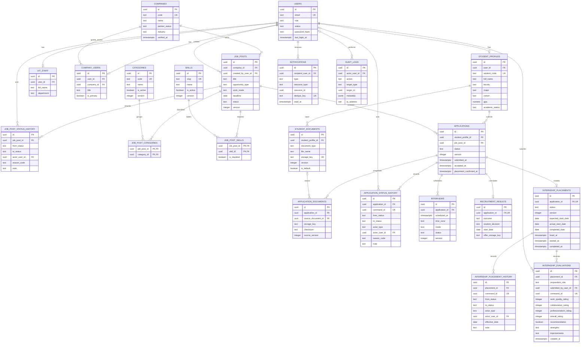

# ERD MVP

## Sơ đồ quan hệ

## Ownership và quyền dữ liệu

- Student chỉ đọc/sửa `student_profiles`, `student_documents` và `applications` của chính mình.
- Company chỉ đọc/sửa `companies`, `job_posts` thuộc company và chỉ thấy application sau khi UIT chuyển đến.
- UIT_ADMIN quản lý đối tác, duyệt job/application và xác nhận placement; không tự gán kết quả tuyển dụng khi chưa có căn cứ.
- UIT_ADMIN theo dõi kỳ thực tập sau `HIRED`; mỗi transition có version, command id, actor history, audit và notification.
- Student và Company chỉ gửi một `internship_evaluations` cho placement thuộc mình sau `COMPLETED`; UIT đọc đủ hai phía, còn Company không đọc nội dung phản hồi Student.
- UIT_ADMIN là vai trò duy nhất được tạo, đổi tên, ngừng hoặc kích hoạt lại category/skill; khóa nghiệp vụ không đổi và bản ghi không bị xóa cứng.
- UIT_ADMIN là vai trò duy nhất được tổng hợp và xuất báo cáo toàn trường; export chỉ đọc các quan hệ hiện có và ghi một `AUDIT_LOGS` với `target_type = REPORT`.
- `application_documents` là snapshot độc lập; thay đổi tài liệu gốc không làm đổi hồ sơ đã gửi.
- `application_status_history`, `job_post_status_history`, `internship_evaluations` và `audit_logs` không có API cập nhật/xóa.
- `notifications` chỉ chứa metadata/deep link, không chứa CV hay internal note.

## Quyết định schema

- Trạng thái dùng `text + CHECK constraint` thay vì PostgreSQL enum để bổ sung trạng thái qua migration dễ hơn. Mọi giá trị vẫn được khóa ở database và đồng bộ với tài liệu domain.
- UUID dùng `gen_random_uuid()`.
- Các bảng mutable có `updated_at`; history/audit chỉ có `created_at`.
- Partial unique index xử lý quy tắc “một đơn đang hoạt động” và “một nơi nhận việc”.
