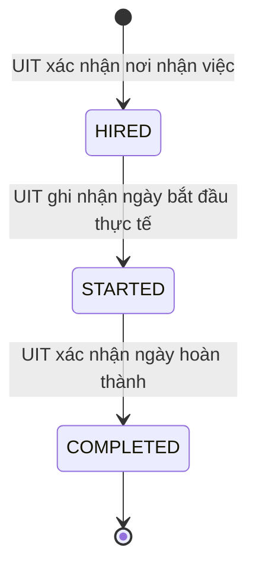

# Vòng đời kỳ thực tập

## Phạm vi

`applications.status = HIRED` vẫn là trạng thái kết thúc của quy trình tuyển dụng. Sau khi UIT xác nhận nơi
nhận việc, hệ thống tạo một `internship_placements` riêng để theo dõi quá trình thực tập mà không mở lại hoặc
thay đổi invariant nhiều đơn của application.

## Quy tắc chuyển trạng thái

| Từ | Đến | Actor | Dữ liệu bắt buộc |
|---|---|---|---|
| Chưa có placement | `HIRED` | `UIT_ADMIN` | Ngày bắt đầu dự kiến từ bước confirm placement |
| `HIRED` | `STARTED` | `UIT_ADMIN` | `expectedVersion`, ngày bắt đầu thực tế không ở tương lai |
| `STARTED` | `COMPLETED` | `UIT_ADMIN` | `expectedVersion`, ngày hoàn thành không trước ngày bắt đầu và không ở tương lai |

- Mỗi application chỉ có tối đa một kỳ thực tập.
- Không cho phép bỏ bước, quay lùi hoặc chuyển tiếp từ `COMPLETED`.
- Mutation khóa placement bằng `SELECT ... FOR UPDATE`, kiểm tra optimistic `version` và dùng
  `Idempotency-Key` UUID. Retry cùng command trả trạng thái hiện tại mà không tạo side effect trùng.
- Lịch sử lưu `from_status`, `to_status`, actor, ngày hiệu lực, ghi chú và command id; không có API sửa/xóa.
- Mỗi transition ghi audit và notification cho sinh viên cùng tất cả recruiter đang hoạt động của doanh nghiệp.
- Các application khác đã được đóng ở transaction confirm placement trước đó không bị tác động bởi lifecycle này.

## API và UI

- `GET /api/v1/uit/placements`: tìm kiếm, lọc trạng thái, xem số liệu và actor history.
- `POST /api/v1/uit/placements/{placementId}/start`: `HIRED → STARTED`.
- `POST /api/v1/uit/placements/{placementId}/complete`: `STARTED → COMPLETED`.
- Portal UIT **Theo dõi kết quả** dùng các API trên và không hiển thị CTA ngoài `availableActions` từ backend.
