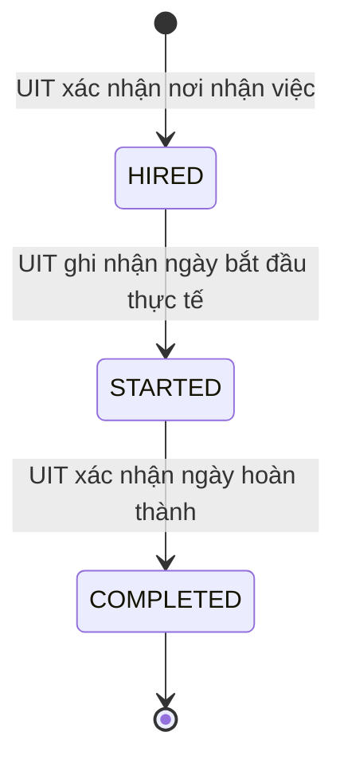

# Vòng đời kỳ thực tập

## Phạm vi

`applications.status = HIRED` vẫn là trạng thái kết thúc của quy trình tuyển dụng. Sau khi UIT xác nhận nơi
nhận việc, hệ thống tạo một `internship_placements` riêng để theo dõi quá trình thực tập mà không mở lại hoặc
thay đổi invariant nhiều đơn của application.

## Quy tắc chuyển trạng thái

| Từ | Đến | Actor | Dữ liệu bắt buộc |
|---|---|---|---|
| Chưa có placement | `HIRED` | `UIT_ADMIN` | Ngày bắt đầu dự kiến từ bước confirm placement |
| `HIRED` | `STARTED` | `UIT_ADMIN` | `expectedVersion`, ngày bắt đầu thực tế không ở tương lai |
| `STARTED` | `COMPLETED` | `UIT_ADMIN` | `expectedVersion`, ngày hoàn thành không trước ngày bắt đầu và không ở tương lai |

- Mỗi application chỉ có tối đa một kỳ thực tập.
- Không cho phép bỏ bước, quay lùi hoặc chuyển tiếp từ `COMPLETED`.
- Mutation khóa placement bằng `SELECT ... FOR UPDATE`, kiểm tra optimistic `version` và dùng
  `Idempotency-Key` UUID. Retry cùng command trả trạng thái hiện tại mà không tạo side effect trùng.
- Lịch sử lưu `from_status`, `to_status`, actor, ngày hiệu lực, ghi chú và command id; không có API sửa/xóa.
- Mỗi transition ghi audit và notification cho sinh viên cùng tất cả recruiter đang hoạt động của doanh nghiệp.
- Các application khác đã được đóng ở transaction confirm placement trước đó không bị tác động bởi lifecycle này.
- Quy trình học thuật của kế hoạch tham chiếu trực tiếp placement này và được mô tả tại
  [`internship-plan-workflow.md`](./internship-plan-workflow.md). Trong rollout đầu, trạng thái kế hoạch chưa chặn
  transition `HIRED → STARTED` để giữ tương thích với dữ liệu hiện có.
- Khi placement ở `STARTED`, sinh viên báo cáo tiến độ theo tuần và doanh nghiệp xác nhận theo quy trình
  [`internship-weekly-log-workflow.md`](./internship-weekly-log-workflow.md). Khi placement chuyển `COMPLETED`,
  nhật ký trở thành dữ liệu theo dõi chỉ đọc và không được tạo thêm.

## Phiếu đánh giá sau hoàn thành

Khi placement ở `COMPLETED`, mỗi bên được gửi tối đa một phiếu bất biến:

- `COMPANY` đánh giá sinh viên; recruiter phải thuộc đúng doanh nghiệp sở hữu job.
- `STUDENT` phản hồi về kỳ thực tập; application phải thuộc đúng hồ sơ sinh viên đang đăng nhập.
- Mỗi phiếu có bốn điểm từ 1–5, lựa chọn khuyến nghị, điểm nổi bật và nội dung cần cải thiện tùy chọn.
- Unique `(placement_id, respondent_role)` ngăn gửi phiếu thứ hai; retry cùng `Idempotency-Key` trả phiếu đã tạo mà không lặp audit/notification.
- Không có API sửa/xóa. Gửi trước `COMPLETED` trả `409 INTERNSHIP_EVALUATION_NOT_AVAILABLE`.
- UIT xem đủ hai phiếu. Student xem phiếu của mình và đánh giá Company. Company chỉ xem phiếu của mình cùng cờ Student đã phản hồi, không nhận nội dung phản hồi riêng của Student.
- Việc gửi phiếu không chuyển trạng thái placement và không sửa application terminal `HIRED`; mỗi lần gửi vẫn có audit và notification đúng tenant.

## API và UI

- `GET /api/v1/uit/placements`: tìm kiếm, lọc trạng thái, xem số liệu và actor history.
- `POST /api/v1/uit/placements/{placementId}/start`: `HIRED → STARTED`.
- `POST /api/v1/uit/placements/{placementId}/complete`: `STARTED → COMPLETED`.
- `GET/POST /api/v1/applications/{applicationId}/internship-evaluations`: Student xem/gửi phiếu thuộc chính mình.
- `GET/POST /api/v1/companies/me/applications/{applicationId}/internship-evaluations`: Company xem/gửi phiếu thuộc đúng doanh nghiệp.
- Portal UIT **Theo dõi kết quả** dùng các API trên và không hiển thị CTA ngoài `availableActions` từ backend.
- Portal UIT hiển thị cả hai phiếu trong placement; portal Student và Company chỉ mở form khi backend trả `canSubmit=true`.
- API và UI lập/duyệt kế hoạch dùng nhóm `/student/internships`, `/company/internships` và
  `/uit/internship-supervision`; mọi CTA lấy từ `availableActions` do backend tính theo actor và trạng thái.
- Cùng nhóm route trên cung cấp `/weekly-logs`; UIT có thêm `/summary` và `/overdue` để giám sát tiến độ toàn trường.
