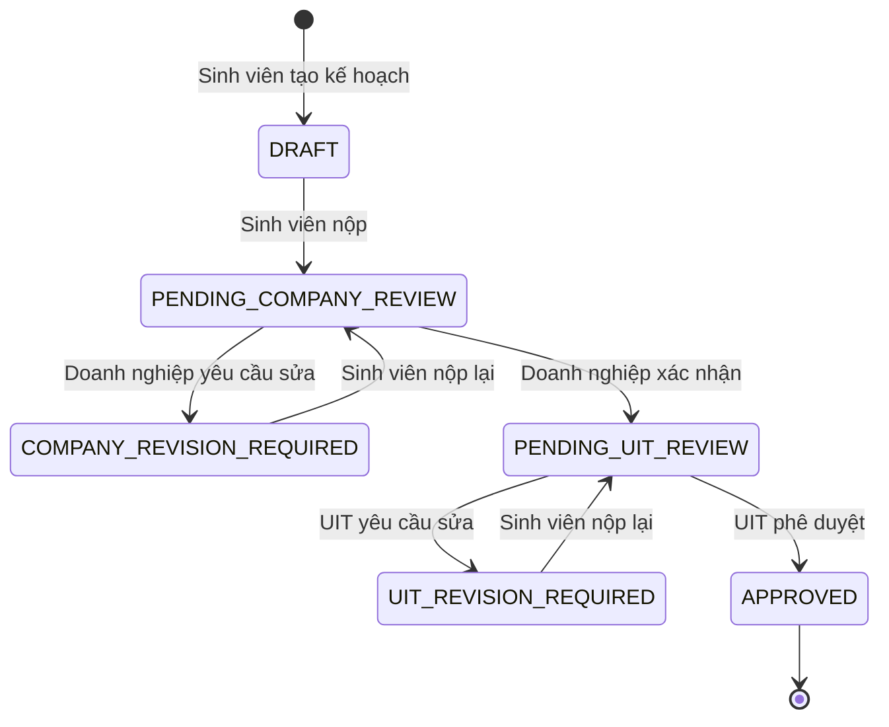

# Quy trình kế hoạch thực tập

## Mục tiêu

`internship_plans` bổ sung quy trình học thuật cho một `internship_placement` đã hình thành từ hồ sơ tuyển dụng. Placement tiếp tục là nguồn dữ liệu duy nhất cho kỳ thực tập; kế hoạch chỉ quản lý nội dung, các lần nộp và phê duyệt của ba vai trò.

## Sơ đồ trạng thái

`CANCELLED` được dành cho giai đoạn mở rộng khi placement bị hủy; API hiện tại chưa công bố thao tác này.

## Quyền sở hữu và thao tác

| Vai trò | Phạm vi dữ liệu | Thao tác |
|---|---|---|
| Sinh viên | Placement thuộc `student_profile_id` của tài khoản | Tạo, lưu nháp, nộp và nộp lại |
| Doanh nghiệp | Placement thuộc `company_id` của tài khoản | Xác nhận hoặc yêu cầu sinh viên chỉnh sửa |
| UIT | Toàn bộ placement | Phê duyệt cuối hoặc yêu cầu chỉnh sửa |

API trả về `404` khi tài nguyên không thuộc quyền sở hữu để không làm lộ sự tồn tại của dữ liệu khác.

## Tính nhất quán

- Mọi lần lưu và chuyển trạng thái dùng optimistic locking qua trường `version`.
- Mọi lệnh chuyển trạng thái dùng `Idempotency-Key`; một khóa không được tái sử dụng cho hành động khác.
- Mỗi lần sinh viên nộp tạo một snapshot JSON bất biến trong `internship_plan_submissions`.
- Mỗi chuyển trạng thái tạo `internship_plan_history`, `audit_logs` và thông báo cho bên tiếp nhận.
- Trong lần triển khai đầu, placement ở `HIRED` hoặc `STARTED` đều được lập kế hoạch; quy trình bắt đầu placement chưa bị chặn bởi trạng thái kế hoạch để giữ tương thích với dữ liệu demo hiện tại.

## Điều kiện nộp

Kế hoạch chỉ được nộp khi có đủ tiêu đề, bộ phận, người hướng dẫn và email doanh nghiệp, mục tiêu, công việc dự kiến, kỹ năng dự kiến, ngày bắt đầu và ngày kết thúc. Ngày kết thúc không được trước ngày bắt đầu.
