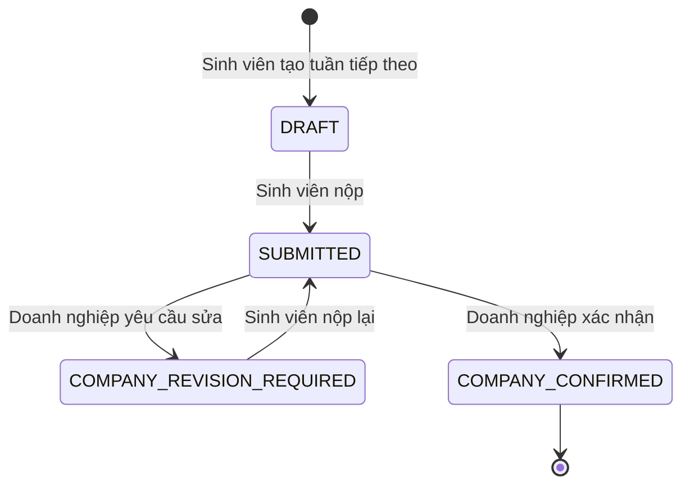

# Quy trình nhật ký thực tập định kỳ

## Mục tiêu

`internship_weekly_logs` lưu nhật ký theo tuần của một `internship_placement` đang diễn ra. Mốc tuần, khoảng ngày và hạn nộp được backend tính từ `actual_start_date`; Sinh viên không tự thay đổi lịch để tránh làm sai chỉ số đúng hạn.

## Sơ đồ trạng thái

`CANCELLED` được dành cho luồng dừng placement và chưa có API công khai trong giai đoạn này. `OVERDUE` không phải trạng thái lưu ở database; API tính `overdue=true` khi nhật ký còn `DRAFT` hoặc `COMPANY_REVISION_REQUIRED` và đã qua `due_date`.

## Quy tắc tuần và deadline

- Mỗi placement chỉ có một nhật ký cho mỗi `week_number`.
- `period_start = actual_start_date + (week_number - 1) × 7 ngày`.
- `period_end = period_start + 6 ngày`.
- `due_date = period_end + 2 ngày`.
- Chỉ được tạo tuần liên tiếp nhỏ nhất chưa có; không cho tạo một tuần bắt đầu sau hiện tại quá 7 ngày.
- Chỉ placement `STARTED` được tạo, sửa hoặc nộp nhật ký.
- Nhật ký `COMPANY_CONFIRMED` là bất biến.

## Quyền và tính nhất quán

| Vai trò | Phạm vi | Thao tác |
|---|---|---|
| Sinh viên | Placement thuộc hồ sơ của mình | Tạo, lưu, nộp và nộp lại |
| Doanh nghiệp | Placement thuộc company của tài khoản | Xác nhận hoặc yêu cầu chỉnh sửa |
| UIT | Toàn bộ placement | Xem timeline, thống kê và danh sách quá hạn |

- Resource ngoài ownership trả `404`.
- Mọi update kiểm tra `expectedVersion`; mọi transition dùng `Idempotency-Key`.
- Mỗi lần nộp tạo snapshot bất biến trong `internship_weekly_log_submissions`.
- Mỗi transition tạo history, audit log và notification có dedupe key theo command và recipient.
