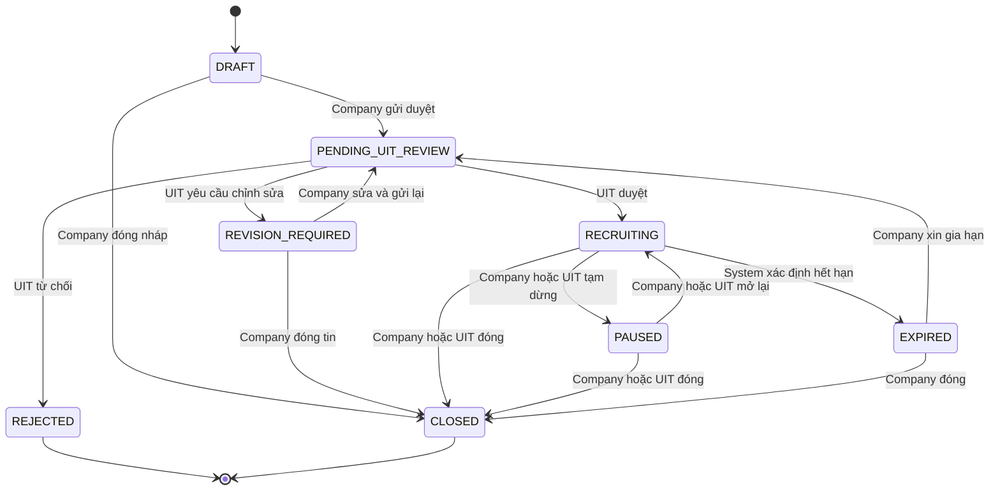

# Job state machine

## Sơ đồ

## Ma trận chuyển trạng thái

| Từ | Hành động | Đến | Actor | Điều kiện bắt buộc |
|---|---|---|---|---|
| `DRAFT` | Gửi duyệt | `PENDING_UIT_REVIEW` | COMPANY | Đủ trường bắt buộc, doanh nghiệp đang hoạt động, deadline hợp lệ |
| `DRAFT` | Đóng | `CLOSED` | COMPANY | Xác nhận thao tác |
| `PENDING_UIT_REVIEW` | Duyệt | `RECRUITING` | UIT_ADMIN | Checklist hợp lệ; ghi reviewer và thời gian |
| `PENDING_UIT_REVIEW` | Yêu cầu sửa | `REVISION_REQUIRED` | UIT_ADMIN | Bắt buộc reason/note |
| `PENDING_UIT_REVIEW` | Từ chối | `REJECTED` | UIT_ADMIN | Bắt buộc reason/note |
| `REVISION_REQUIRED` | Gửi lại | `PENDING_UIT_REVIEW` | COMPANY | Đã xử lý phản hồi và dữ liệu hợp lệ |
| `REVISION_REQUIRED` | Đóng | `CLOSED` | COMPANY | Bắt buộc xác nhận |
| `RECRUITING` | Tạm dừng | `PAUSED` | COMPANY/UIT_ADMIN | Bắt buộc reason nếu UIT thao tác |
| `RECRUITING` | Hết hạn | `EXPIRED` | SYSTEM | `deadline < current_date` |
| `RECRUITING` | Đóng | `CLOSED` | COMPANY/UIT_ADMIN | Cảnh báo nếu còn đơn đang xử lý; lưu reason |
| `PAUSED` | Mở lại | `RECRUITING` | COMPANY/UIT_ADMIN | Deadline còn hiệu lực |
| `PAUSED` | Đóng | `CLOSED` | COMPANY/UIT_ADMIN | Lưu reason |
| `EXPIRED` | Xin gia hạn | `PENDING_UIT_REVIEW` | COMPANY | Deadline mới hợp lệ |
| `EXPIRED` | Đóng | `CLOSED` | COMPANY | Xác nhận thao tác |

`REJECTED` và `CLOSED` là terminal. API không nhận một trường `status` tùy ý từ client; mỗi hành động có endpoint riêng.

## Quy tắc hiển thị và dữ liệu

- Sinh viên chỉ thấy tin `RECRUITING` có deadline chưa qua.
- Tin `PAUSED`, `EXPIRED` hoặc `CLOSED` không nhận đơn mới.
- Việc tin ngừng tuyển không xóa hoặc tự kết thúc các đơn đã nộp.
- Mỗi transition tăng `version`, ghi `job_post_status_history` và audit khi hành động nhạy cảm.
- Khi hai người duyệt cùng một tin, chỉ transition khớp `status/version` hiện tại được phép thành công.
