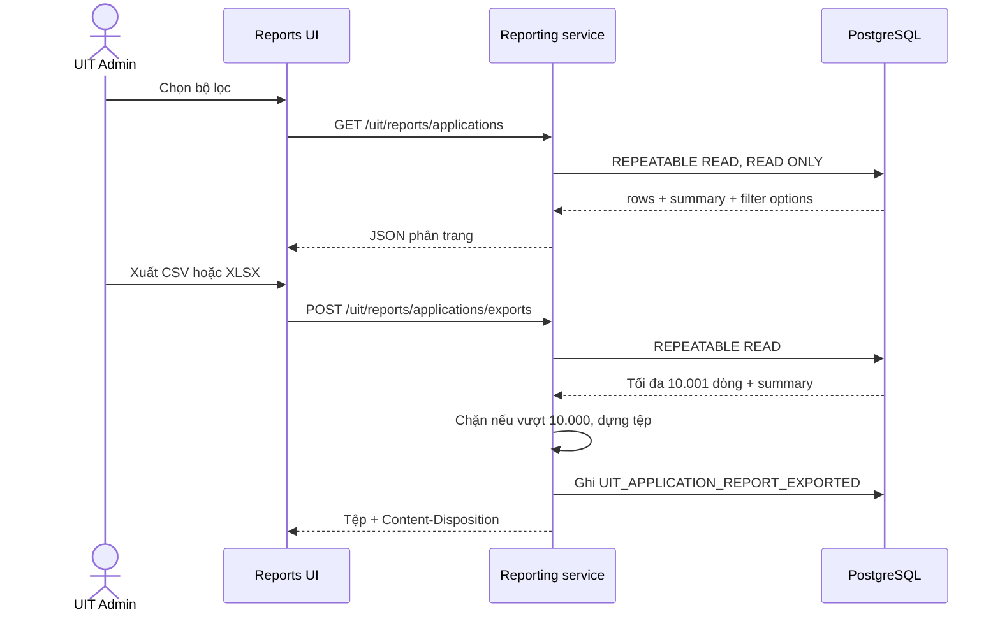

# Báo cáo hồ sơ ứng tuyển UIT

## Phạm vi nghiệp vụ

Màn báo cáo dành riêng cho `UIT_ADMIN`, tổng hợp các hồ sơ đã tồn tại trong `applications`. Báo cáo là lát cắt chỉ đọc đối với pipeline tuyển dụng: không tạo transition, không sửa `ApplicationStatus`, `JobStatus`, kết quả tuyển dụng hoặc placement.

Bộ lọc hỗ trợ:

- khoảng ngày nộp hồ sơ theo `Asia/Ho_Chi_Minh`, bao gồm trọn ngày kết thúc;
- khoa, ngành, khóa;
- doanh nghiệp;
- trạng thái application;
- loại cơ hội;
- từ khóa trên MSSV, họ tên, tên tin hoặc tên doanh nghiệp.

Các chỉ số `totalApplications`, `uniqueStudents`, `companyCount`, `hiredCount`, `hiredRate` và phân bố trạng thái luôn được tính trên toàn bộ tập khớp bộ lọc, không chỉ trang đang hiển thị.

## Luồng dữ liệu

Snapshot transaction bảo đảm bảng chi tiết, chỉ số và tệp xuất nhìn cùng một trạng thái dữ liệu. Audit chỉ commit sau khi tệp được dựng thành công; metadata lưu loại báo cáo, định dạng, số dòng và bộ lọc, không lưu nội dung CV hoặc offer.

## Định dạng xuất

### CSV

- UTF-8 có BOM để Excel trên Windows nhận đúng tiếng Việt.
- Dùng CRLF và escape theo quy ước CSV.
- Giá trị bắt đầu bằng `=`, `+`, `-` hoặc `@` sau khoảng trắng được thêm dấu nháy đơn để ngăn formula injection.

### XLSX

- Sheet `Tổng quan`: thời điểm xuất, bộ lọc, KPI, tỷ lệ placement và phân bố trạng thái.
- Sheet `Dữ liệu`: 16 cột có kiểu ngày thật, header cố định, autofilter, độ rộng cột giới hạn và wrap text.
- KPI tổng hồ sơ, placement và tỷ lệ dùng công thức tham chiếu sheet dữ liệu; workbook yêu cầu Excel tính lại khi mở.
- Tên tệp dùng thời gian `Asia/Ho_Chi_Minh` và không chứa dữ liệu do người dùng nhập.

## Giới hạn và bảo vệ

- Chỉ `UIT_ADMIN` được gọi `/uit/reports/**`; Student và Company nhận `403 AUTH_FORBIDDEN` trước khi service chạy.
- Mỗi lần xuất tối đa 10.000 dòng để giới hạn bộ nhớ và thời gian transaction. Kết quả lớn hơn trả `422 REPORT_EXPORT_TOO_LARGE` và không ghi audit thành công.
- Mọi response `/api/v1` giữ `Cache-Control: private, no-store`.
- Migration `0015_uit_application_reporting.sql` chỉ bổ sung index cho thời gian và chiều lọc; không thay đổi khóa hoặc state machine.
- PDF chưa thuộc lát cắt này vì roadmap ưu tiên CSV/Excel và chỉ làm PDF nếu còn thời gian.
