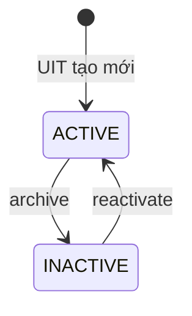

# Vòng đời danh mục ngành nghề và kỹ năng

`categories` và `skills` là dữ liệu tham chiếu dùng chung cho tin tuyển dụng. UIT Admin là vai trò duy nhất được quản trị hai tập dữ liệu này.

## Trạng thái

| Trạng thái | Ý nghĩa | Có thể gắn vào tin mới |
|---|---|:---:|
| `ACTIVE` | Đang được UIT công nhận và cho phép sử dụng | Có |
| `INACTIVE` | Ngừng dùng cho dữ liệu mới nhưng vẫn giữ liên kết lịch sử | Không |

## Bất biến nghiệp vụ

1. `code` của category và `slug` của skill là khóa nghiệp vụ ổn định, không sửa sau khi tạo.
2. UIT có thể đổi tên hiển thị; thao tác dùng `expectedVersion` để chống ghi đè đồng thời.
3. Không xóa cứng category/skill qua API.
4. Chỉ được chuyển `ACTIVE → INACTIVE` khi không còn job ở `DRAFT`, `PENDING_UIT_REVIEW`, `REVISION_REQUIRED`, `RECRUITING` hoặc `PAUSED` tham chiếu.
5. Job mới hoặc job đang sửa chỉ chấp nhận category/skill `ACTIVE`. Việc kiểm tra khóa bản ghi bằng `FOR KEY SHARE` để đồng bộ với transaction archive.
6. Mọi create/update/archive/reactivate và audit log được commit trong cùng transaction.
7. Mọi state change bắt buộc lý do; lịch sử job đã kết thúc vẫn hiển thị tên category/skill qua khóa ngoại hiện có.

## Mã audit

- Category: `CATEGORY_CREATED`, `CATEGORY_UPDATED`, `CATEGORY_ARCHIVED`, `CATEGORY_REACTIVATED`.
- Skill: `SKILL_CREATED`, `SKILL_UPDATED`, `SKILL_ARCHIVED`, `SKILL_REACTIVATED`.
