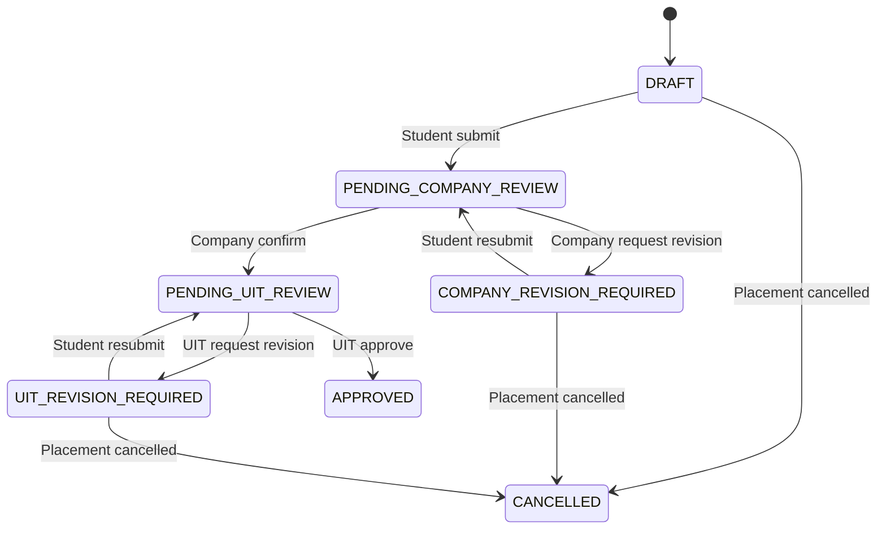

# UIT Career Hub — Kế hoạch phát triển thành đồ án tốt nghiệp

## 1. Mục đích của tài liệu

Tài liệu này là nguồn triển khai cho giai đoạn tiếp theo của UIT Career Hub. Khi bắt đầu một phiên phát triển mới, cần đọc tài liệu này cùng mã nguồn và tài liệu domain hiện tại trước khi sửa code.

Mục tiêu là mở rộng hệ thống từ cổng tuyển dụng và xác nhận nơi thực tập thành hệ thống quản lý toàn bộ quá trình thực tập học thuật giữa Sinh viên, Doanh nghiệp và UIT.

Yêu cầu trực tiếp mới nhất của người dùng luôn có ưu tiên cao hơn tài liệu này. Nếu mã nguồn đã thay đổi, phải đối chiếu lại schema, API, state machine và test trước khi triển khai.

## 2. Trạng thái nền tảng hiện tại

Hệ thống hiện có:

- Frontend React 19 + Vite cho ba portal Sinh viên, UIT Admin và Doanh nghiệp.
- Backend Java 21 + Spring Boot 3.5 trong `backend/`.
- Backend Express cũ chỉ còn trong `backend-express-legacy/` để đối chiếu, không phát triển tính năng mới tại đây.
- PostgreSQL với migration hiện tại đến `0018`.
- `internship_placements` quản lý `HIRED → STARTED → COMPLETED`.
- `internship_plans` quản lý kế hoạch thực tập qua hai lớp duyệt Company và UIT, có snapshot mỗi lần nộp.
- `internship_evaluations` lưu phiếu đánh giá bất biến của Company và Student sau `COMPLETED`.
- Cloudflare R2 private cho CV, tài liệu sinh viên và PDF offer.
- History, audit log, notification, idempotency và optimistic locking đã được dùng trong các transition quan trọng.
- Playwright đã có smoke test ba portal và các luồng E2E chính.

Trước khi bắt đầu giai đoạn này phải bảo đảm:

1. `pnpm typecheck` đạt.
2. PostgreSQL test/E2E đang chạy.
3. `pnpm test` đạt trên backend Java hiện tại.
4. `pnpm build` đạt.
5. `pnpm e2e:smoke` đạt trên database E2E cô lập.
6. Các thay đổi UI đang làm dở đã được kiểm tra và commit trên nhánh riêng.

### 2.1. Tiến độ triển khai ngày 22/08/2026

- **Giai đoạn 0:** baseline compile/build đạt; frontend test đạt. Integration test và E2E thật đang chờ PostgreSQL test/E2E hoạt động tại `localhost:5432`.
- **Giai đoạn 1 cho kế hoạch thực tập:** hoàn thành state machine, migration `0018`, ERD, tài liệu domain và OpenAPI `1.5.0`.
- **Giai đoạn 2:** đã triển khai backend Spring Boot, UI ba vai trò, seed placement demo, unit test workflow và kịch bản Playwright hai vòng revision.
- Trình duyệt giả lập API đã xác nhận ba portal render đúng, không có console error hoặc Vite error overlay.
- Chưa bật gate bắt buộc kế hoạch `APPROVED` trước khi placement `STARTED`; đây là quyết định tương thích ngược đã nêu trong kế hoạch.
- Giai đoạn tiếp theo chỉ bắt đầu sau khi chạy migration/seed và kịch bản E2E mới trên PostgreSQL cô lập.

## 3. Phạm vi đề xuất

### 3.1. Phạm vi bắt buộc

1. Sinh viên lập và nộp kế hoạch thực tập.
2. Doanh nghiệp xác nhận hoặc yêu cầu chỉnh sửa kế hoạch.
3. UIT phê duyệt hoặc yêu cầu chỉnh sửa kế hoạch.
4. Sinh viên nộp nhật ký thực tập định kỳ.
5. Doanh nghiệp xác nhận hoặc yêu cầu chỉnh sửa nhật ký.
6. UIT theo dõi tiến độ, quá hạn và các trường hợp cần can thiệp.
7. Sinh viên nộp báo cáo cuối kỳ.
8. Doanh nghiệp xác nhận hoặc yêu cầu chỉnh sửa báo cáo.
9. UIT duyệt báo cáo và đóng hồ sơ học thuật.
10. Mọi quyết định có history, audit, notification, ownership và kiểm soát gửi lặp.

### 3.2. Phạm vi tùy chọn sau khi luồng chính ổn định

- Email nhắc hạn và tổng hợp hồ sơ chậm tiến độ.
- Xuất báo cáo PDF cho UIT.
- Dashboard phân tích kỹ năng và chất lượng đối tác.
- Gợi ý việc làm theo kỹ năng có giải thích và bộ tiêu chí đánh giá rõ ràng.
- Tích hợp SSO UIT khi có tài liệu chính thức.

### 3.3. Ngoài phạm vi của giai đoạn đầu

- Chat realtime.
- FCM.
- AI sinh nội dung tự động.
- Multi-school hoặc multi-tenant.
- Tạo role Company Mentor riêng; phiên bản đầu dùng recruiter thuộc đúng company làm actor doanh nghiệp.
- Thay đổi state machine tuyển dụng hiện tại chỉ để thuận tiện cho UI mới.

## 4. Giá trị học thuật của đề tài

Đề tài cần được trình bày là cổng quản trị quy trình liên kết thực tập và tuyển dụng của UIT, không chỉ là website đăng tin việc làm.

Các điểm đóng góp cần chứng minh:

- Quy trình ba bên có hai lớp kiểm soát của nhà trường và doanh nghiệp.
- State machine rõ ràng, không cập nhật trạng thái trực tiếp từ UI.
- RBAC và ownership được kiểm tra ở backend.
- Idempotency chống tạo side effect trùng khi retry.
- Optimistic locking chống ghi đè khi hai người cùng thao tác.
- History và audit log giúp truy vết quyết định.
- Tài liệu riêng tư được cấp URL ngắn hạn và không lộ storage key.
- Dashboard/SLA giúp phát hiện sinh viên hoặc hồ sơ chậm tiến độ.
- Dữ liệu quy trình có thể dùng để đánh giá hiệu quả hợp tác với doanh nghiệp.

## 5. Quy trình nghiệp vụ tổng thể

```mermaid
flowchart LR
    A[UIT xác nhận nơi thực tập] --> B[Sinh viên lập kế hoạch]
    B --> C[Doanh nghiệp duyệt kế hoạch]
    C -->|Yêu cầu sửa| B
    C -->|Xác nhận| D[UIT duyệt kế hoạch]
    D -->|Yêu cầu sửa| B
    D -->|Phê duyệt| E[UIT ghi nhận bắt đầu]
    E --> F[Sinh viên nộp nhật ký định kỳ]
    F --> G[Doanh nghiệp xác nhận nhật ký]
    G -->|Yêu cầu sửa| F
    G --> H[UIT theo dõi tiến độ và SLA]
    H --> I[Sinh viên nộp báo cáo cuối kỳ]
    I --> J[Doanh nghiệp duyệt báo cáo]
    J -->|Yêu cầu sửa| I
    J --> K[UIT duyệt báo cáo]
    K -->|Yêu cầu sửa| I
    K --> L[UIT ghi nhận hoàn thành]
    L --> M[Company và Student gửi phiếu đánh giá]
    M --> N[UIT đóng hồ sơ học thuật]
```



### 5.1. Nguyên tắc tích hợp với placement hiện tại

- `internship_placements` vẫn là aggregate nguồn cho kỳ thực tập.
- Không tạo một bảng “kỳ thực tập” khác cạnh tranh với `internship_placements`.
- Kế hoạch, nhật ký và báo cáo cuối kỳ đều tham chiếu `placement_id`.
- Application vẫn giữ terminal `HIRED`; không mở lại application khi xử lý hồ sơ học thuật.
- Không tự động chuyển placement sang `STARTED` chỉ vì kế hoạch được duyệt; UIT vẫn thực hiện transition có ngày hiệu lực.
- Không tự động chuyển placement sang `COMPLETED` chỉ vì báo cáo được duyệt; UIT vẫn xác nhận hoàn thành.
- Luồng demo cũ phải tiếp tục chạy. Việc bắt buộc có kế hoạch được phê duyệt trước `STARTED` chỉ bật sau khi migration, seed và E2E mới đã sẵn sàng.

## 6. State machine đề xuất

### 6.1. Kế hoạch thực tập



Trạng thái lưu trong database:

- `DRAFT`
- `PENDING_COMPANY_REVIEW`
- `COMPANY_REVISION_REQUIRED`
- `PENDING_UIT_REVIEW`
- `UIT_REVISION_REQUIRED`
- `APPROVED`
- `CANCELLED`

Quy tắc:

- Mỗi placement chỉ có một kế hoạch hiện hành.
- Mỗi lần submit/resubmit tạo snapshot nội dung bất biến để đối chiếu.
- Company chỉ xử lý placement thuộc company của recruiter.
- UIT mới được chuyển kế hoạch sang `APPROVED`.
- Sau `APPROVED`, không sửa trực tiếp; thay đổi lớn phải tạo yêu cầu điều chỉnh có history riêng.

### 6.2. Nhật ký thực tập

Trạng thái:

- `DRAFT`
- `SUBMITTED`
- `COMPANY_REVISION_REQUIRED`
- `COMPANY_CONFIRMED`
- `CANCELLED`

Quy tắc:

- Unique `(placement_id, week_number)` hoặc `(placement_id, period_start, period_end)`.
- `OVERDUE` là trạng thái tính toán từ deadline, không lưu thành trạng thái nghiệp vụ nếu không cần.
- Chỉ placement `STARTED` mới được tạo hoặc nộp nhật ký.
- Nhật ký đã `COMPANY_CONFIRMED` là bất biến.
- Company không được xác nhận nhật ký của placement khác company.
- UIT được xem toàn bộ nhưng không sửa nội dung sinh viên.

### 6.3. Báo cáo cuối kỳ

Trạng thái:

- `DRAFT`
- `PENDING_COMPANY_REVIEW`
- `COMPANY_REVISION_REQUIRED`
- `PENDING_UIT_REVIEW`
- `UIT_REVISION_REQUIRED`
- `ACCEPTED`
- `CANCELLED`

Quy tắc:

- Chỉ placement `STARTED` mới được nộp báo cáo.
- Company xác nhận nội dung liên quan đến công việc thực tế trước khi UIT duyệt.
- UIT mới được chuyển báo cáo sang `ACCEPTED`.
- Placement chỉ được `COMPLETED` khi báo cáo đã `ACCEPTED`, sau khi feature gate được bật.
- File báo cáo dùng R2 private, URL ký ngắn hạn và kiểm tra ownership ở backend.

## 7. Mô hình dữ liệu dự kiến

Tên và chi tiết cuối cùng phải được chốt sau khi đọc migration hiện tại. Các migration mới dự kiến bắt đầu từ `0018`.

### 7.1. `internship_plans`

- `id uuid primary key`
- `placement_id uuid unique references internship_placements(id)`
- `status varchar`
- `title varchar`
- `department varchar`
- `company_supervisor_name varchar`
- `company_supervisor_email varchar`
- `objectives text`
- `expected_tasks text`
- `expected_skills text`
- `start_date date`
- `end_date date`
- `current_submission_no integer`
- `version integer`
- `created_at`, `updated_at`

### 7.2. `internship_plan_submissions`

- Snapshot bất biến của từng lần submit/resubmit.
- Lưu `plan_id`, `submission_no`, nội dung snapshot, actor và thời gian.
- Không cập nhật hoặc xóa snapshot đã được reviewer sử dụng.

### 7.3. `internship_plan_history`

- `plan_id`, `command_id`, `from_status`, `to_status`.
- `actor_type`, `actor_user_id`, `reason_code`, `note`, `metadata`.
- Unique `(plan_id, command_id)` để hỗ trợ idempotency.

### 7.4. `internship_weekly_logs`

- `id`, `placement_id`, `week_number` hoặc khoảng ngày.
- `status`, `work_summary`, `outcomes`, `difficulties`, `next_plan`.
- `submitted_at`, `company_reviewed_at`, `version`.
- Unique theo placement và kỳ báo cáo.

### 7.5. `internship_weekly_log_history`

- Lưu mọi transition, actor, command và reason.

### 7.6. `internship_final_reports`

- `id`, `placement_id unique`, `status`.
- `summary`, `achievements`, `skills_gained`, `limitations`.
- Tham chiếu artifact/file private.
- `current_submission_no`, `version`, timestamps.

### 7.7. `internship_artifacts`

- Dùng chung cho file kế hoạch, minh chứng nhật ký và báo cáo cuối kỳ nếu model tài liệu hiện tại không phù hợp.
- `placement_id`, `owner_user_id`, `artifact_type`, `file_name`, `mime_type`, `size_bytes`, `storage_object_key`.
- `status`, `created_at`, `deleted_at` nếu cần soft delete.
- Không trả `storage_object_key` ra API.

## 8. API dự kiến

API cuối cùng phải cập nhật trong OpenAPI và dùng envelope/error contract hiện tại.

### 8.1. Sinh viên

- `GET /api/v1/student/internships/{placementId}`
- `GET /api/v1/student/internships/{placementId}/plan`
- `PUT /api/v1/student/internships/{placementId}/plan`
- `POST /api/v1/student/internships/{placementId}/plan/submit`
- `GET /api/v1/student/internships/{placementId}/weekly-logs`
- `POST /api/v1/student/internships/{placementId}/weekly-logs`
- `PUT /api/v1/student/internships/{placementId}/weekly-logs/{logId}`
- `POST /api/v1/student/internships/{placementId}/weekly-logs/{logId}/submit`
- `GET /api/v1/student/internships/{placementId}/final-report`
- `PUT /api/v1/student/internships/{placementId}/final-report`
- `POST /api/v1/student/internships/{placementId}/final-report/submit`

### 8.2. Doanh nghiệp

- `GET /api/v1/company/internships`
- `GET /api/v1/company/internships/{placementId}`
- `POST /api/v1/company/internships/{placementId}/plan/confirm`
- `POST /api/v1/company/internships/{placementId}/plan/request-revision`
- `POST /api/v1/company/internships/{placementId}/weekly-logs/{logId}/confirm`
- `POST /api/v1/company/internships/{placementId}/weekly-logs/{logId}/request-revision`
- `POST /api/v1/company/internships/{placementId}/final-report/confirm`
- `POST /api/v1/company/internships/{placementId}/final-report/request-revision`

### 8.3. UIT Admin

- `GET /api/v1/uit/internship-supervision`
- `GET /api/v1/uit/internship-supervision/{placementId}`
- `POST /api/v1/uit/internship-supervision/{placementId}/plan/approve`
- `POST /api/v1/uit/internship-supervision/{placementId}/plan/request-revision`
- `POST /api/v1/uit/internship-supervision/{placementId}/final-report/accept`
- `POST /api/v1/uit/internship-supervision/{placementId}/final-report/request-revision`
- `GET /api/v1/uit/internship-supervision/overdue`
- `GET /api/v1/uit/internship-supervision/summary`

### 8.4. Quy ước mutation

- Transition bắt buộc có `Idempotency-Key`.
- Body cập nhật bắt buộc có `expectedVersion` khi sửa dữ liệu hiện hành.
- Reason bắt buộc với mọi nhánh request revision, cancel hoặc early termination.
- Sai role trả `403`.
- Resource không thuộc student/company trả `404` để không lộ sự tồn tại.
- State/version conflict trả `409` với error code ổn định.

## 9. Màn hình cần triển khai

### 9.1. Portal Sinh viên

Thêm phân hệ **Quá trình thực tập** gồm:

- Tổng quan kỳ thực tập và timeline.
- Kế hoạch thực tập.
- Nhật ký theo tuần.
- Báo cáo cuối kỳ.
- Tài liệu và minh chứng.
- Việc cần làm, deadline và lịch sử xử lý.

### 9.2. Portal Doanh nghiệp

Thêm phân hệ **Sinh viên đang thực tập** gồm:

- Danh sách placement thuộc company.
- Bộ lọc trạng thái kế hoạch, nhật ký và báo cáo.
- Chi tiết sinh viên và timeline.
- Duyệt kế hoạch.
- Duyệt nhật ký.
- Duyệt báo cáo cuối kỳ.
- Đánh giá thực tập hiện có sau `COMPLETED`.

### 9.3. Portal UIT Admin

Mở rộng **Theo dõi kết quả tuyển dụng** hoặc tạo phân hệ **Quản lý thực tập** gồm:

- Hàng đợi kế hoạch chờ duyệt.
- Hàng đợi báo cáo cuối kỳ.
- Danh sách sinh viên quá hạn.
- Timeline đầy đủ theo placement.
- Bộ lọc khoa, ngành, khóa, company, cán bộ phụ trách và trạng thái.
- Dashboard tỷ lệ đúng hạn, hoàn thành và trường hợp cần can thiệp.

### 9.4. Yêu cầu UI chung

- Dùng dữ liệu API thật, không tạo CTA giả.
- Có loading, empty, error, retry, disabled và success state.
- Confirmation modal cho transition không thể đảo ngược.
- Hiển thị reason và deadline rõ ràng.
- Responsive tại `1440×1024`, `1024×768`, `768×1024`, `390×844`.
- Keyboard, focus visible, label/ARIA và zoom 200% phải sử dụng được.
- Không hiển thị nút mà backend không cho phép; backend vẫn là lớp bảo mật quyết định.

## 10. Thông báo, audit và SLA

### 10.1. Sự kiện thông báo tối thiểu

- Student submit/resubmit plan → Company.
- Company confirm plan → UIT.
- Company/UIT request revision → Student.
- UIT approve plan → Student và Company.
- Student submit weekly log → Company.
- Company request revision/confirm log → Student.
- Student submit final report → Company.
- Company confirm report → UIT.
- UIT accept/request revision → Student và Company phù hợp.
- Deadline gần đến hoặc quá hạn → người chịu trách nhiệm.

### 10.2. Dedupe và retry

- Mỗi notification có dedupe key dựa trên aggregate, command và recipient.
- Retry cùng command không tạo notification/history/audit/file trùng.
- Email nếu bật phải đi qua outbox; lỗi email không rollback transaction nghiệp vụ.

### 10.3. Chỉ số SLA

- Thời gian Company duyệt kế hoạch.
- Thời gian UIT duyệt kế hoạch.
- Số nhật ký nộp đúng hạn/quá hạn.
- Thời gian Company xác nhận nhật ký.
- Thời gian duyệt báo cáo cuối kỳ.
- Tỷ lệ placement hoàn thành.
- Tỷ lệ sinh viên yêu cầu đổi/dừng nơi thực tập.

## 11. Phân quyền và quyền riêng tư

| Tài nguyên | Student | Company | UIT |
|---|---|---|---|
| Kế hoạch của placement | Chủ sở hữu | Company của placement | Xem và duyệt |
| Nhật ký | Chủ sở hữu | Company của placement | Xem |
| Báo cáo cuối kỳ | Chủ sở hữu | Company của placement | Xem và duyệt |
| File private | File được phép của chính mình | Placement thuộc company | Toàn bộ theo nhiệm vụ UIT |
| Phiếu Student | Xem của mình | Không xem nội dung riêng | Xem |
| Phiếu Company | Xem | Company đã gửi | Xem |
| Audit/history | Timeline phù hợp | Timeline thuộc company | Timeline đầy đủ |

Không đưa access token, refresh cookie, presigned URL, storage key, secret hoặc nội dung file vào structured log.

## 12. Kế hoạch triển khai theo lát cắt

### Giai đoạn 0 — Ổn định baseline

- Chốt và commit các thay đổi UI hiện tại.
- Khởi động PostgreSQL test/E2E.
- Chạy compile, test, build, smoke E2E.
- Xác nhận backend Java public hoặc ghi rõ demo local.
- Cập nhật tài liệu còn mô tả Express là backend hiện hành.

### Giai đoạn 1 — Domain và contract

- Viết use case và acceptance criteria.
- Chốt state machine kế hoạch, nhật ký và báo cáo.
- Chốt schema/migration `0018+`.
- Cập nhật ERD và OpenAPI trước hoặc đồng thời với code.
- Chốt quy tắc backward compatibility cho placement hiện có.

### Giai đoạn 2 — Vertical slice kế hoạch thực tập

- Migration và seed.
- Repository/service/controller Spring Boot.
- RBAC, ownership, transaction, history, audit và notification.
- UI Student tạo/nộp.
- UI Company xác nhận/yêu cầu sửa.
- UI UIT duyệt/yêu cầu sửa.
- Unit/integration/E2E cho happy flow và nhánh revision.

### Giai đoạn 3 — Vertical slice nhật ký định kỳ

- Schema, API và UI ba vai trò.
- Deadline và overdue computation.
- Company confirm/request revision.
- UIT dashboard theo dõi chậm tiến độ.
- E2E ownership, retry, version conflict và overdue.

**Trạng thái 24/08/2026:** Đã hoàn thành code, contract, seed, UI và bộ test của lát cắt. Các cổng không cần
database đã đạt; migration và E2E thật còn chờ PostgreSQL local hoạt động. Xem
[`WEEKLY_LOG_IMPLEMENTATION_STATUS.md`](./WEEKLY_LOG_IMPLEMENTATION_STATUS.md).

### Giai đoạn 4 — Vertical slice báo cáo cuối kỳ

- Nội dung báo cáo và upload file R2 private.
- Company confirm/request revision.
- UIT accept/request revision.
- Gate placement `COMPLETED` theo báo cáo đã accepted sau khi dữ liệu demo được cập nhật.
- E2E upload/download/ownership và complete placement.

### Giai đoạn 5 — Báo cáo, vận hành và hoàn thiện UI

- Dashboard SLA và export.
- Email nhắc hạn nếu môi trường sẵn sàng.
- Accessibility và responsive audit.
- Error monitoring, trace và privacy review.
- Performance smoke cho danh sách, filter, transition và export.

### Giai đoạn 6 — Hồ sơ bảo vệ

- Cập nhật proposal và báo cáo chi tiết.
- Vẽ BPMN, use case, sequence, ERD và state machine khớp code.
- Ghi số liệu unit, integration, E2E, security và performance thực tế.
- Chuẩn bị demo 8–10 phút, demo dài và video dự phòng.
- Chốt release candidate; không bổ sung chức năng lớn sau mốc này.

## 13. Test bắt buộc

### 13.1. Happy flow

1. UIT xác nhận placement.
2. Student tạo và submit plan.
3. Company confirm.
4. UIT approve.
5. UIT start placement.
6. Student submit weekly log.
7. Company confirm log.
8. Student submit final report và file.
9. Company confirm report.
10. UIT accept report.
11. UIT complete placement.
12. Company và Student gửi evaluations.
13. UIT xem đầy đủ timeline và hai phiếu.

### 13.2. Nhánh ngoại lệ

- Company yêu cầu sửa plan.
- UIT yêu cầu sửa plan.
- Company yêu cầu sửa weekly log.
- Company hoặc UIT yêu cầu sửa final report.
- Submit sai trạng thái.
- Retry cùng `Idempotency-Key`.
- Dùng lại key cho command khác.
- Hai người cập nhật cùng version.
- Student A mở placement Student B.
- Company A mở placement Company B.
- Upload sai MIME, size hoặc signature.
- Presigned URL hết hạn.
- Deadline quá hạn.
- Placement bị dừng hoặc hủy trước khi hoàn tất.

### 13.3. Cổng chất lượng

```powershell
pnpm typecheck
pnpm test
pnpm build
pnpm e2e:smoke
pnpm e2e:full
git diff --check
```

E2E phải dùng database riêng có tên chứa `e2e` và bật cờ reset an toàn. Không chạy reset/seed trên production.

## 14. Definition of Done

Một lát cắt chỉ hoàn thành khi:

- Nghiệp vụ và state transition được mô tả rõ.
- Migration chạy được trên database sạch và database đã có dữ liệu.
- Backend validation, RBAC, ownership và transaction đầy đủ.
- Idempotency và optimistic locking được kiểm tra.
- OpenAPI cập nhật.
- UI dùng API thật và có đủ trạng thái hiển thị.
- History, audit và notification đúng actor/recipient.
- File private không lộ storage key và truy cập chéo trả `404`.
- Unit/integration test quan trọng đạt.
- Playwright happy flow và nhánh quan trọng đạt.
- Build đạt và không có lỗi console cản trở demo.
- Tài liệu domain, demo script và báo cáo kiểm thử được cập nhật.

## 15. Thứ tự ưu tiên khi có mâu thuẫn

1. Yêu cầu mới nhất của người dùng.
2. Database migration và transaction/authorization backend hiện hành.
3. State machine trong `docs/domain/`.
4. OpenAPI.
5. Integration/E2E test.
6. Tài liệu này.
7. Tài liệu proposal ban đầu.

## 16. Cách bắt đầu ở phiên phát triển tiếp theo

Khi người dùng yêu cầu triển khai theo tài liệu này:

1. Chạy `git status` và không ghi đè thay đổi chưa commit.
2. Kiểm tra `.codegraph/`; nếu có, dùng CodeGraph trước khi tìm code thủ công.
3. Đọc tài liệu này, `docs/domain/internship-placement-lifecycle.md`, ERD, OpenAPI và controller/service hiện tại.
4. Chạy baseline test phù hợp.
5. Bắt đầu từ **Giai đoạn 0**, sau đó triển khai **Giai đoạn 1 và Giai đoạn 2** theo vertical slice.
6. Không triển khai đồng thời toàn bộ schema/API/UI nếu chưa có một lát cắt happy flow chạy được.
7. Mỗi PR chỉ nên chứa một lát cắt hoặc một nhóm thay đổi liên quan chặt chẽ.

## 17. Tiêu chí dừng mở rộng tính năng

Dừng bổ sung chức năng mới và chuyển sang hồ sơ bảo vệ khi:

- Happy flow tuyển dụng hiện tại vẫn đạt.
- Happy flow quản lý thực tập mới đạt từ plan đến final report.
- Các test P0 về role, ownership, state, idempotency, file và privacy đạt.
- Backend Java đã được triển khai trên môi trường demo hoặc có phương án demo local ổn định.
- Proposal, BPMN, use case, ERD, sequence, state machine và báo cáo kiểm thử khớp code.
- Có kịch bản demo và video dự phòng.
