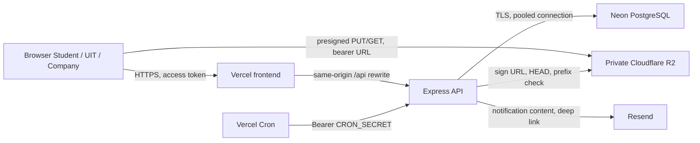

# Threat model Giai đoạn 4

Phiên bản: `2026-08-11`

Phạm vi: web app ba vai trò, Express API, Neon PostgreSQL, Cloudflare R2, Resend và Vercel Cron.

Tài liệu này là threat model dựa trên contract và mã nguồn hiện tại. Đây không phải biên bản pentest hộp đen hay bằng chứng backup/restore trên Neon. Mục tiêu là xác định tài sản, actor, trust boundary, threat, control hiện có và phần việc production còn lại.

## Tài sản cần bảo vệ

| Tài sản | Tác động nếu lộ/lệch/mất |
|---|---|
| Mật khẩu, access token, refresh token, activation token | Chiếm tài khoản và giả mạo vai trò |
| Hồ sơ sinh viên, CV, bảng điểm, giấy xác nhận | Lộ PII và học tập; rủi ro pháp lý/uy tí |
| Đơn ứng tuyển, phỏng vấn, kết quả, offer | Sai quyết định tuyển dụng hoặc lộ thông tin nhạy cảm |
| Placement và phiếu đánh giá thực tập | Sai dữ liệu đồ án/quản lý thực tập |
| Dữ liệu doanh nghiệp và recruiter | Truy cập chéo tenant, giả mạo doanh nghiệp |
| Audit log, notification, email outbox | Mất truy vết hoặc lộ dữ liệu qua kênh phụ |
| Secret Vercel/Neon/R2/Resend/Cron/JWT | Chiếm toàn bộ dịch vụ hoặc dữ liệu |
| Backup và khả năng khôi phục | Mất dữ liệu không thể phục hồi |

## Actor và giả định tin cậy

| Actor | Quyền hợp lệ | Khả năng bị lạm dụng |
|---|---|---|
| Khách chưa đăng nhập | Đăng ký sinh viên, login, refresh, logout, activation | Chiếm email chưa xác minh, tạo tài khoản hàng loạt, credential stuffing, token replay, payload lớn |
| Student | Hồ sơ và đơn của chính mình | IDOR sang sinh viên khác, upload file độc hại |
| UIT Admin | Duyệt và quản trị toàn trường | Lạm dụng quyền rộng, xuất dữ liệu hàng loạt |
| Company recruiter | Job/candidate/offer thuộc doanh nghiệp | IDOR sang doanh nghiệp khác, lộ CV |
| Vercel Cron | Chạy tổng hợp và retry email | Secret bị lộ hoặc replay |
| Quản trị hạ tầng | Deploy, migration, secret, backup | Nhầm production/test, lộ secret, thao tác phá hủy |
| Dịch vụ ngoài | Neon, R2, Resend, Vercel | Sự cố nhà cung cấp hoặc credential bị chiếm |

## Trust boundary và luồng dữ liệu

Mỗi mũi tên đi qua một trust boundary. Backend là điểm quyết định quyền; frontend, UUID do client gửi, metadata file và presigned URL đều không được xem là bí mật hay bằng chứng ownership.

## Ma trận threat và control

Mức rủi ro là phần còn lại sau control hiện tại: `Thấp`, `Trung bình`, `Cao`.

| ID | Threat / STRIDE | Control và bằng chứng hiện tại | Rủi ro còn lại / hành động |
|---|---|---|---|
| AUTH-01 | Credential stuffing, brute force (S/DoS) | Login/refresh/activation có rate limit `20/15 phút`; user bị `LOCKED` sau 5 lần sai. Xem [`auth.routes.ts`](../../backend/src/modules/auth/auth.routes.ts), [`auth.repository.ts`](../../backend/src/modules/auth/auth.repository.ts), [`auth.integration.test.ts`](../../backend/src/modules/auth/auth.integration.test.ts). | **Trung bình**: chưa có rate limit phân tán theo account + IP hay alert bất thường. |
| AUTH-02 | Dùng JWT cũ sau khi tài khoản bị khóa/đổi role/tenant (E) | Mỗi request được bảo vệ đều đối chiếu user `ACTIVE`, role, `studentProfileId` và `companyId` hiện tại trước khi gắn principal. Xem [`auth.ts`](../../backend/src/middleware/auth.ts), composition bắt buộc trong [`app.ts`](../../backend/src/app.ts), negative test trong [`auth.test.ts`](../../backend/src/middleware/auth.test.ts) và test DB trong [`auth.integration.test.ts`](../../backend/src/modules/auth/auth.integration.test.ts). | **Thấp** cho lock/suspend/đổi context. **Trung bình** cho logout: refresh token bị thu hồi nhưng access token cũ vẫn có thể dùng tối đa 15 phút nếu user vẫn `ACTIVE`; cần session version/deny-list nếu yêu cầu logout tức thì. |
| AUTH-03 | Trộm/replay refresh token, CSRF (S/E) | Refresh token opaque trong cookie `HttpOnly`, `Secure` trên production, `SameSite=lax`, path chỉ `/api/v1/auth`; token xoay vòng và replay thu hồi family. CORS chỉ cho origin cấu hình và credentials. Xem [`auth.routes.ts`](../../backend/src/modules/auth/auth.routes.ts), [`app.ts`](../../backend/src/app.ts), [`env.ts`](../../backend/src/config/env.ts). | **Trung bình**: phải giữ same-origin production; nếu chuyển sang `SameSite=none` cần thêm CSRF token. |
| IDOR-01 | Student đọc/sửa hồ sơ, document, application của người khác (E/I) | ID sở hữu lấy từ principal đã đối chiếu DB; repository luôn lọc `student_profile_id`; tài nguyên chéo trả `404`. Xem [`rbac-matrix.md`](./rbac-matrix.md), [`application.repository.ts`](../../backend/src/modules/applications/application.repository.ts), [`application.integration.test.ts`](../../backend/src/modules/applications/application.integration.test.ts). | **Thấp**; duy trì negative test khi thêm endpoint mới. |
| IDOR-02 | Recruiter truy cập job/candidate/CV/offer của doanh nghiệp khác (E/I) | `companyId` không nhận từ body; query ghép application/job với company của principal; cross-company trả `404`. Xem [`job.service.ts`](../../backend/src/modules/jobs/job.service.ts), [`application.repository.ts`](../../backend/src/modules/applications/application.repository.ts), các integration test job/application. | **Thấp**; E2E cross-company phải tiếp tục chạy trước release. |
| DOC-01 | Upload file quá lớn, MIME giả, không phải PDF (T/DoS) | Schema chỉ nhận `application/pdf`, tối đa 10 MiB; storage key do server sinh; sau upload kiểm tra HEAD size/MIME và 5 byte `%PDF-`, sai thì xóa object. Xem [`application.schemas.ts`](../../backend/src/modules/applications/application.schemas.ts), [`application.service.ts`](../../backend/src/modules/applications/application.service.ts), [`application.schemas.test.ts`](../../backend/src/modules/applications/application.schemas.test.ts). | **Trung bình**: chưa quét malware hay parse PDF sâu; cần quarantine/AV trước người dùng thật. |
| DOC-02 | Lộ presigned URL hoặc storage key (I) | Bucket private; URL GET mặc định 5 phút, URL PUT 10 phút; chỉ cấp sau RBAC/ownership; API không trả storage key; tên download được làm sạch. Xem [`cloudflare-r2.md`](../deployment/cloudflare-r2.md), [`r2-object-storage.ts`](../../backend/src/modules/storage/r2-object-storage.ts), [`application.service.ts`](../../backend/src/modules/applications/application.service.ts). | **Trung bình**: presigned URL tự nó là bearer credential; không đưa vào log/analytics/email, có thể giảm TTL nếu UX cho phép. |
| STATE-01 | Bỏ qua lifecycle hoặc replay command (T/R) | Transition kiểm tra state trong transaction, lock row và idempotency key; contract chuẩn tại [`application-state-machine.md`](../domain/application-state-machine.md) và [`internship-placement-lifecycle.md`](../domain/internship-placement-lifecycle.md). | **Thấp** trong happy flow hiện có; thay state machine phải cập nhật OpenAPI + test cùng PR. |
| ADMIN-01 | UIT Admin bị chiếm hoặc lạm dụng quyền rộng (E/I) | RBAC tách vai trò, mutation quan trọng có audit. Xem [`rbac-routes.test.ts`](../../backend/src/security/rbac-routes.test.ts). | **Trung bình**: chưa có MFA và phân quyền chi tiết theo chức danh; bắt buộc trước rollout rộng. |
| API-01 | Payload JSON/quần thể request gây DoS (DoS) | Body JSON giới hạn `1mb`; auth endpoint có rate limit; query có phân trang. Xem [`app.ts`](../../backend/src/app.ts). | **Trung bình**: API nghiệp vụ chưa có rate limit theo user/IP; đây là hardening kế tiếp. |
| LOG-01 | Secret/PII/presigned URL xuất hiện trong log (I/R) | Lỗi 5xx dùng JSON event allow-list; không thu body/query/header/user PII; logger redaction key nhạy cảm, Bearer/JWT, URL credential và presigned signature. Xem [`structured-logger.ts`](../../backend/src/observability/structured-logger.ts), [`error-handler.ts`](../../backend/src/middleware/error-handler.ts). | **Trung bình**: redaction không thay thế DLP; cần kiểm tra retention/quyền truy cập log và test payload mới khi thêm integration. |
| EMAIL-01 | Email lộ CV/offer/PII hoặc bị spoof (I/S) | Email chỉ mang title/body/deep link, không đính kèm file hay presigned URL; HTML được escape; outbox có retry/idempotency. Xem [`email-template.ts`](../../backend/src/modules/email/email-template.ts), [`email-delivery.service.ts`](../../backend/src/modules/email/email-delivery.service.ts), [`vercel-neon.md`](../deployment/vercel-neon.md). | **Trung bình**: chỉ bật gửi thật sau khi xác minh SPF/DKIM và review nội dung notification không chứa PII nhạy cảm. |
| CONFIG-01 | Demo account/secret còn tồn tại khi mở cho user thật (S/E) | Production bundle hard-disable demo picker và quét demo credential; production-readiness gate kiểm tra reset flags, secret separation/rotation và demo users bằng read-only query. Xem [`production-readiness.ts`](../../backend/src/security/production-readiness.ts). | **Cao** cho đến khi operator thực sự suspend/xóa demo users và rotate external credentials; PR không tự động mutation production. |
| DB-01 | Mất dữ liệu hoặc restore không dùng được (DoS/T) | Drill có guard đã backup Neon test branch và restore vào PostgreSQL 17 local tạm; 17 migrations/28 tables/checksum/row counts khớp. Xem [`2026-08-11-neon-test-backup-restore.md`](./evidence/2026-08-11-neon-test-backup-restore.md). | **Trung bình**: cần lập lịch drill định kỳ, retention/RPO chính thức và đo RTO trên hạ tầng restore gần production hơn. |
| OBS-01 | Sự cố/attack không được phát hiện (R) | Mỗi response có trace ID; lỗi 5xx được ghi structured JSON và có thể gửi webhook HTTPS với timeout/failure isolation. | **Trung bình**: production vẫn phải cấu hình endpoint, retention, dashboard và alert; business/auth metrics chưa được aggregate. |

## Hardening đã thực hiện trong lát cắt này

`AUTH-02` được đóng cho trường hợp account/role/tenant thay đổi:

1. JWT vẫn phải qua chữ ký, issuer, audience, expiry và claim validation.
2. Middleware truy vấn user theo `sub` trên mỗi request được bảo vệ.
3. Chỉ gắn `request.auth` khi user còn `ACTIVE`, role và ownership context khớp JWT.
4. Sai bất kỳ điều kiện nào trả `401 AUTH_ACCESS_REVOKED`; lỗi database fail closed và không gắn principal.
5. Tất cả router được bảo vệ bắt buộc nhận `AccessPrincipalStore` từ composition root; không có default bỏ qua kiểm tra.

Đánh đổi: có thêm một query nhẹ trên mỗi request API đã xác thực. Không cache trong lát cắt này để giữ thu hồi tức thì; nếu cần cache sau này phải định nghĩa rõ cửa sổ stale và cơ chế invalidation.

## Gate bảo mật cho release candidate

- Không có endpoint nghiệp vụ mới nằm ngoài RBAC matrix và negative test.
- E2E phải có cross-company denial; backend phải có test IDOR cho document/offer.
- File sai MIME, sai signature hoặc quá 10 MiB phải bị từ chối/xóa trước khi thành document hợp lệ.
- Không log request body, Authorization/Cookie, password/token, storage key hay presigned URL.
- Diễn tập restore chỉ trên database/Neon branch test; lưu command, timestamp, RPO/RTO, checksum/count và kết quả smoke.
- Trước user thật: ẩn demo account, vô hiệu demo reset, rotate toàn bộ secret, bật monitoring/alert và xác minh SPF/DKIM nếu bật email.
- Chỉ merge `develop` khi full unit/integration/build/OpenAPI/Playwright xanh; không đưa `main` cho đến release candidate.
