# UI route inventory và live-data audit

Ngày audit: **10/08/2026**
Baseline đối chiếu: **v0.1.0 / `0bce5df0`**
Phạm vi trình duyệt: ảnh trước thay đổi được chụp trên production bằng tài khoản demo sinh viên và chỉ đọc; ảnh
sau thay đổi cùng các trạng thái lỗi/lọc/responsive được kiểm tra trên frontend/backend local với dữ liệu demo hiện
có. Audit không thực hiện mutation trên production.

## 1. Đối chiếu state machine và OpenAPI

- `ApplicationStatus` trong OpenAPI có đủ 13 trạng thái của
  `docs/domain/application-state-machine.md`.
- Các transition application trong happy flow đều dùng endpoint hành động riêng: submit, resubmit,
  withdraw, cancel interview, UIT supplement/reject/forward, company start-review/reject/interview/result,
  student accept/decline và UIT confirm placement.
- `JobStatus` trong OpenAPI có đủ 8 trạng thái của `docs/domain/job-state-machine.md`.
- OpenAPI hiện chỉ có endpoint cho lát cắt tạo nháp, cập nhật, gửi duyệt và UIT
  approve/request-revision/reject. Các transition pause/reopen/close/extend/expire có trong state machine nhưng
  chưa có endpoint công khai; UI hiện tại không được giả lập các transition này.
- Lát cắt lifecycle không đổi `ApplicationStatus`; nó bổ sung aggregate `PlacementStatus` và endpoint UIT-only
  riêng để application `HIRED` vẫn terminal của quy trình tuyển dụng.

## 2. Inventory theo vai trò

Quy ước:

- **Live**: dữ liệu chính lấy từ API và CTA nghiệp vụ gọi API thật.
- **Một phần**: dữ liệu chính live nhưng còn control chỉ để trình bày hoặc chưa nối hành vi.
- **Tĩnh**: số liệu/nội dung mẫu trong mã nguồn; không được dùng làm bằng chứng nghiệp vụ.

### Sinh viên

| Route/màn hình | Trạng thái | API chính | Ghi nhận |
|---|---|---|---|
| Tổng quan | Live | `GET /students/me/dashboard` | Có loading/error/retry/empty; CTA điều hướng hoạt động. |
| Việc làm | Live | `GET /jobs`, `GET /applications` | Tìm kiếm, lọc thực tập, chọn tin và ứng tuyển dùng dữ liệu thật. Lát cắt này bổ sung retry và empty state theo bộ lọc. |
| Doanh nghiệp | Live | `GET /companies`, `GET /companies/{id}` | Tìm kiếm, lọc và mở cơ hội theo doanh nghiệp hoạt động. |
| Đơn ứng tuyển | Live | `GET /applications` và các endpoint action | Hành động lấy từ `availableActions`; lát cắt này sửa việc hiển thị chi tiết ngoài kết quả lọc. |
| Ứng tuyển hai bước | Live | `GET /students/me`, `GET /students/me/documents`, `POST /applications` | Đúng contract hai bước; chỉ dùng tài liệu đã xác minh. |
| Hồ sơ & CV | Live | `/students/me`, `/students/me/documents/**` | Có upload/download/default/delete và phản hồi trạng thái. |
| Lịch phỏng vấn | Live | `/students/me/interviews/**` | Xác nhận/hủy dùng API và state machine hiện tại. |
| Thông báo | Live | `/notifications/**` | Inbox, read/read-all và deep link hoạt động. |

### UIT Admin

| Route/màn hình | Trạng thái | API chính | Ghi nhận |
|---|---|---|---|
| Tổng quan vận hành | Live | `GET /uit/dashboard` | Số liệu hàng đợi và phễu lấy từ PostgreSQL qua API. |
| Doanh nghiệp đối tác | Live | `/uit/companies/**` | CRUD/trạng thái/recruiter dùng API thật. |
| Duyệt tin tuyển dụng | Live | `/uit/jobs/**` | Approve/revision/reject theo action endpoint. |
| Xác minh tài liệu | Live | `/uit/student-documents/**` | Danh sách, tải PDF private và review. |
| Duyệt hồ sơ sinh viên | Live | `/uit/applications/**` | Supplement/reject/forward và tải snapshot tài liệu. |
| Theo dõi kết quả | Live | placement queue, confirm placement, `GET/POST /uit/placements/**` | Bảo toàn transaction nhiều đơn; theo dõi tiếp `HIRED → STARTED → COMPLETED` với actor history và optimistic lock. |
| Nhắc việc & tác vụ | Ẩn khỏi portal | Chưa có API quản trị | Không còn xuất hiện trong điều hướng bảo vệ; chỉ mở lại khi có API và dữ liệu vận hành thật. |
| Thông báo | Live | `/notifications/**` | Dùng inbox chung theo ownership. |
| Báo cáo tuyển dụng | Live | `GET /uit/reports/applications`, `POST /uit/reports/applications/exports` | Lọc dữ liệu thật theo kỳ/khoa/ngành/doanh nghiệp/trạng thái và xuất CSV/XLSX có audit. |
| Tài khoản & nhật ký | Ẩn khỏi portal | Chưa có API admin access/audit UI | Không còn xuất hiện trong điều hướng bảo vệ; route không hợp lệ tự quay về Tổng quan. |

### Doanh nghiệp

| Route/màn hình | Trạng thái | API chính | Ghi nhận |
|---|---|---|---|
| Tổng quan tuyển dụng | Live | `GET /companies/me/dashboard` | Số liệu, ứng viên và hiệu quả tin lấy từ API. |
| Hồ sơ doanh nghiệp | Live | `GET/PATCH /companies/me/profile` | Form dùng version để cập nhật an toàn. |
| Tin tuyển dụng | Live | `/companies/me/jobs/**` | Tạo/lưu/gửi và sửa theo phản hồi UIT. |
| Ứng viên | Live | `/companies/me/candidates` và action endpoints | Ownership, tải tài liệu, phỏng vấn và PASS/FAIL dùng API thật. |
| Lịch phỏng vấn | Live | `GET /companies/me/interviews` | Danh sách và deep link về đúng application. |
| Thông báo | Live | `/notifications/**` | Dùng inbox chung theo ownership. |

## 3. Control dùng chung

- Ô **Đi nhanh đến màn hình** chỉ tìm trong các route live của đúng vai trò, có nút submit và thông báo khi không tìm thấy.
- Avatar mở menu tài khoản thật, hiển thị định danh phiên và cho phép đăng xuất.
- Sidebar có `aria-label`, route hiện tại có `aria-current`, trang có skip link; nút đăng xuất vẫn hiện ở bố cục hẹp.
- Cấu hình điều hướng được tách sang `student/`, `uit/`, `company/`; shell và hàm tìm route nằm trong `shared/`.

## 4. Lát cắt đã chọn

Student Jobs/Applications được ưu tiên vì xuất hiện trực tiếp trong demo và có ảnh hưởng cao:

1. bỏ component/dữ liệu prototype sinh viên không còn được render;
2. chỉ hiển thị detail thuộc tập kết quả đang lọc;
3. có empty state riêng cho “chưa có dữ liệu” và “không khớp bộ lọc”;
4. có retry cho lỗi tải danh sách;
5. bổ sung nhãn truy cập, `aria-expanded`, `aria-pressed`, `role=status/alert`;
6. giữ nguyên endpoint, mutation và trạng thái kỹ thuật.

## 5. Bằng chứng trước thay đổi

### Bước 1 — Tổng quan sinh viên: tốt

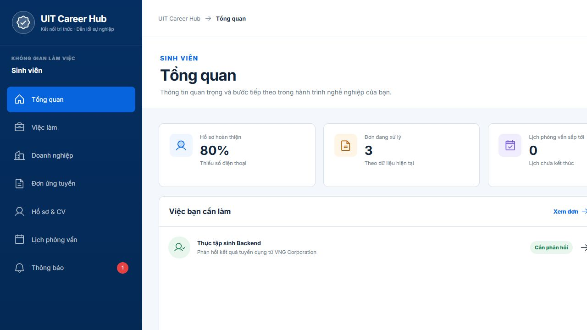

Dữ liệu dashboard live, CTA rõ. Cần tiếp tục kiểm tra keyboard/focus bằng công cụ chuyên dụng.

### Bước 2 — Việc làm: cần cải thiện trạng thái lọc/lỗi

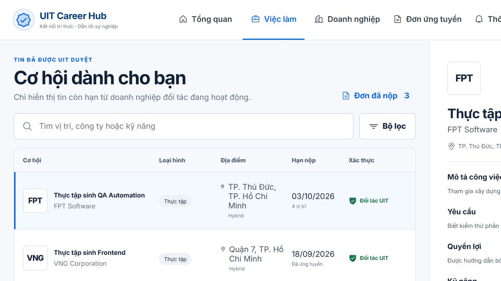

Danh sách và chi tiết live; trước lát cắt này, lỗi tải không có retry và detail có thể giữ một tin nằm ngoài kết
quả lọc.

### Bước 3 — Đơn ứng tuyển: cần cải thiện trạng thái lọc/lỗi

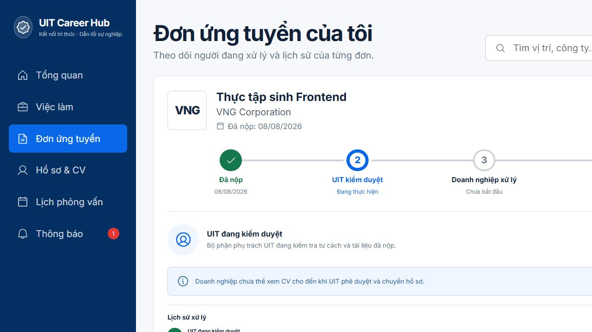

State/CTA live; trước lát cắt này, bộ lọc rỗng vẫn có thể hiển thị card chi tiết của một đơn ngoài kết quả.

## 6. Bằng chứng sau thay đổi

### Bước 4 — Việc làm và happy flow hiện tại: tốt

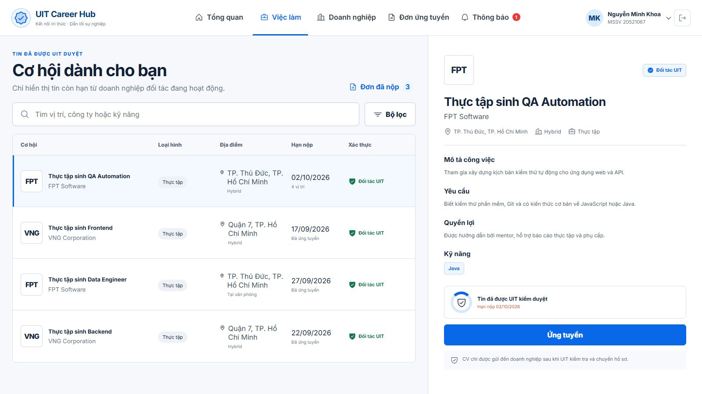

Danh sách/chi tiết vẫn dùng dữ liệu API và CTA ứng tuyển giữ nguyên. Item được chọn có trạng thái truy cập rõ.

### Bước 5 — Bộ lọc việc làm không có kết quả: tốt

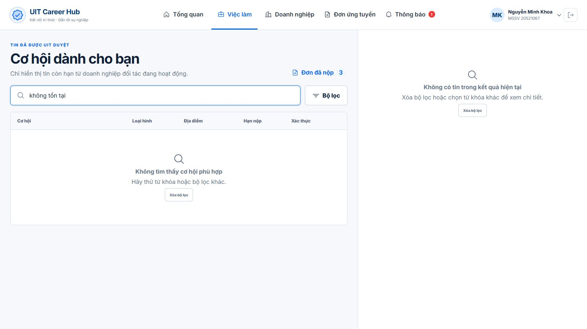

Danh sách và detail cùng phản ánh tập lọc rỗng; người dùng có CTA xóa bộ lọc thay vì nhìn thấy tin ngoài kết quả.

### Bước 6 — Đơn ứng tuyển và happy flow hiện tại: tốt

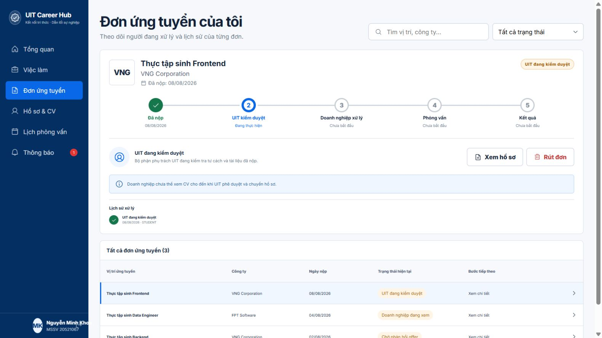

Timeline, history, `availableActions` và danh sách ba đơn tiếp tục hiển thị từ API hiện tại.

### Bước 7 — Bộ lọc đơn không có kết quả: tốt

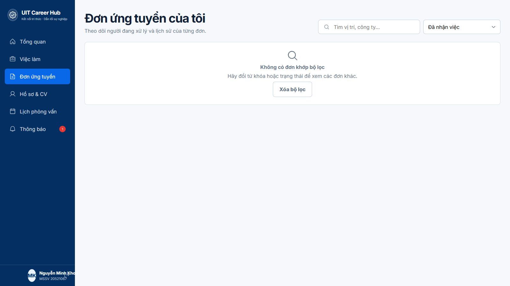

Card chi tiết ngoài bộ lọc không còn xuất hiện; CTA xóa bộ lọc khôi phục danh sách.

### Bước 8 — Điều hướng sinh viên trên mobile: tốt

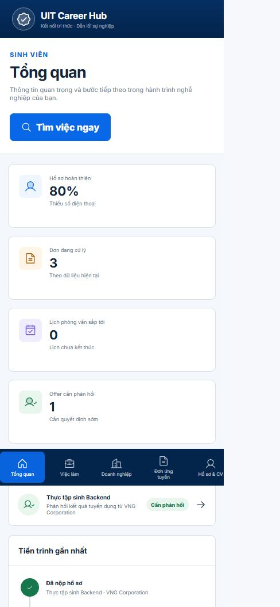

Thanh điều hướng đáy cho phép cuộn ngang thay vì ẩn route. Kiểm tra DOM tại `390×844` xác nhận đủ 7 mục:
Tổng quan, Việc làm, Doanh nghiệp, Đơn ứng tuyển, Hồ sơ & CV, Lịch phỏng vấn và Thông báo.

Kiểm tra responsive bằng browser tại `1440×1024`, `1024×768`, `768×1024`, `390×844` không phát hiện
overflow ngang ở cấp trang. Ở màn nhỏ, detail việc làm được ẩn theo breakpoint và bảng đơn cuộn trong chính
container của bảng.

### Bước 9 — UIT Admin sau khi loại màn prototype: tốt

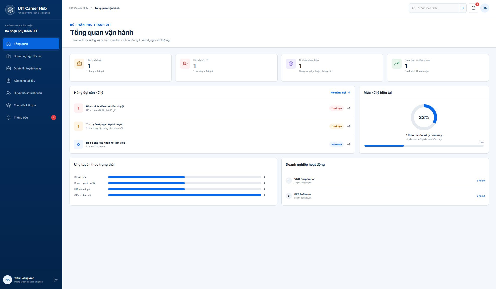

Dashboard, Companies, Job Review, Documents, Applications và Placements tiếp tục dùng API hiện có. Ba màn
Scheduler/Reports/Access không còn trong điều hướng; tìm nhanh `Scheduler` trả về thông báo không tìm thấy thay vì mở màn giả.

### Bước 10 — Duyệt tin UIT và trạng thái thao tác: tốt

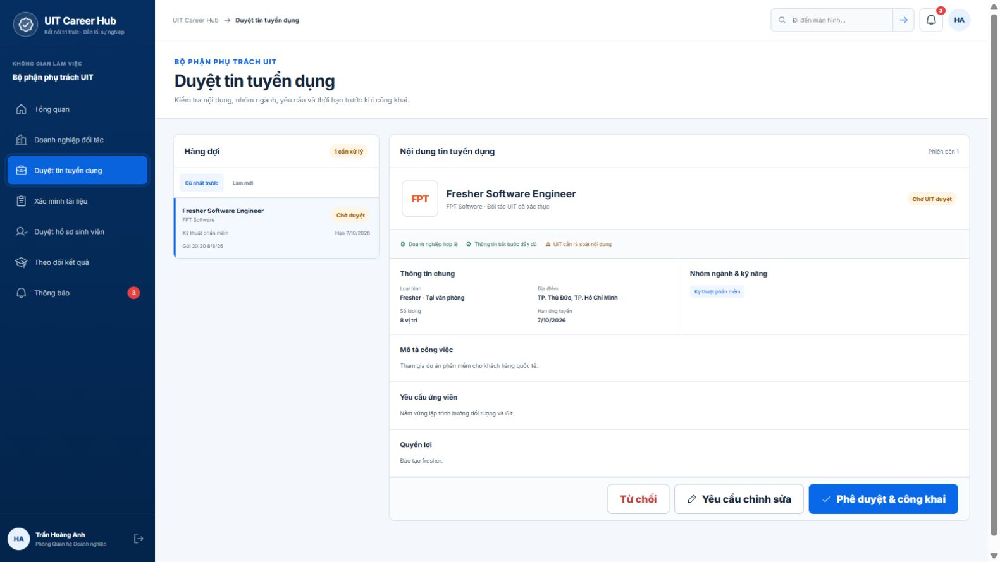

Hàng đợi, chi tiết và ba CTA quyết định vẫn đi qua endpoint action hiện tại; việc tách shell/lazy import không đổi contract.

### Bước 11 — Company Jobs và control dùng chung: tốt

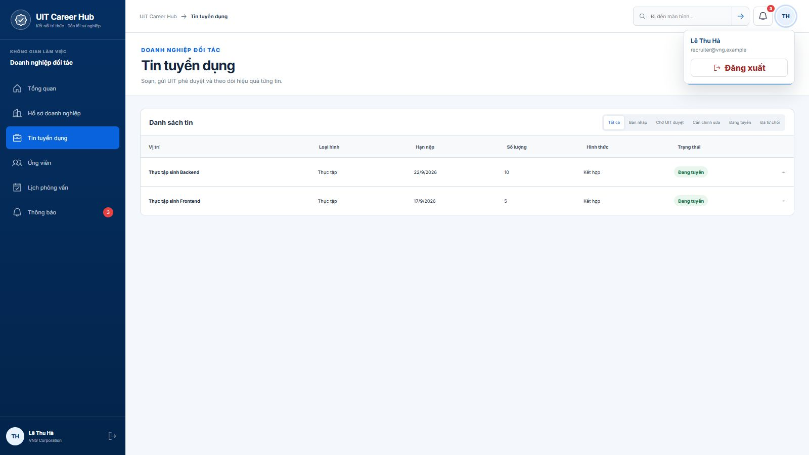

Tìm nhanh đã điều hướng đến đúng route Company Jobs. Avatar mở menu chứa đúng email phiên và hành động đăng xuất;
Jobs/Candidates/Interviews tiếp tục lấy dữ liệu API.

### Bước 12 — Bundle theo portal: tốt

Build production tách `RolePortals` thành chunk khoảng **181 kB** và chunk khởi tạo khoảng **346 kB**; cảnh báo chunk
535 kB trước đó không còn xuất hiện.

## 7. Giới hạn bằng chứng

- Ảnh chứng minh bố cục và nội dung nhìn thấy, không chứng minh đầy đủ WCAG.
- Đã bổ sung skip link, focus-visible hiện có, landmark/nav label, `aria-current`, trạng thái tìm nhanh và menu tài khoản.
  Audit ảnh/DOM không đủ để kết luận WCAG; vẫn cần một vòng screen reader, contrast tự động và zoom 200% thủ công trước RC.
- Không mutation dữ liệu production trong audit này; happy flow tiếp tục được bảo vệ bằng integration tests và
  bộ kiểm tra bắt buộc của repository.

## 8. Xác minh trước bàn giao

- `pnpm typecheck`: đạt.
- `pnpm openapi:validate`: đạt, OpenAPI 3.1.0 có 71 paths.
- `pnpm test`: đạt; frontend **9/9**, backend **187/187** (gồm integration tests trên Neon test riêng).
- `pnpm build`: đạt; portal đã được lazy-load và không còn cảnh báo chunk 535 kB.
- Ba health check trong handoff đều trả HTTP 200: backend, kết nối database qua backend và kết nối database qua
  frontend proxy.
- PostgreSQL local riêng tại `localhost:55432` và Neon `DATABASE_URL_TEST` riêng đều đã được migrate, chạy
  `db:demo:reset` với email/R2 tắt và đạt **12/12** checkpoint. Guard trước lệnh reset xác nhận host test khác host
  runtime/production; không có mutation nào chạy trên `DATABASE_URL` production.
